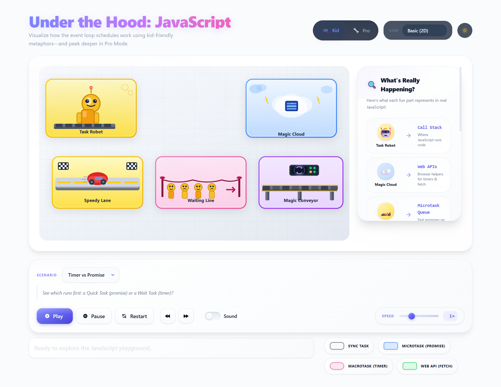
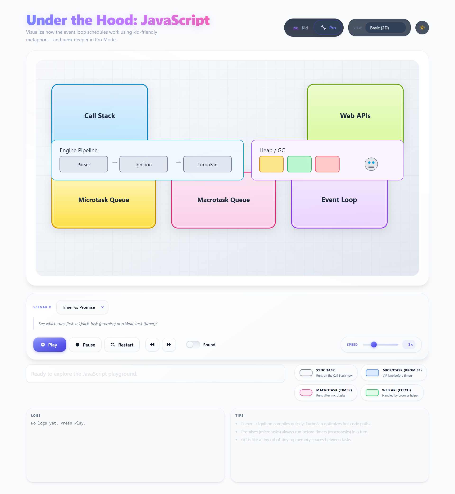
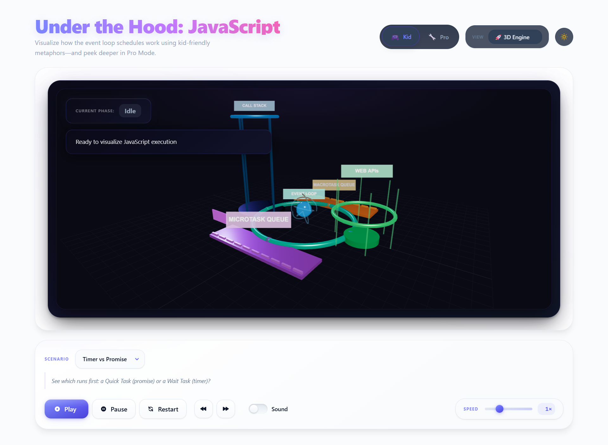

# Under the Hood: JavaScript Visualizer

[](https://github.com/mnaimfaizy/under-the-hood/actions/workflows/ci.yml)

An interactive, kid-friendly visualizer for the JavaScript event loop and execution model. Built with Svelte, Vite, Tailwind CSS, Three.js, and GSAP.

## 📸 Screenshots

<table>
  <tr>
    <td width="33%">
      
      <p align="center"><b>Kid Mode</b><br/>Simple and friendly visualization</p>
    </td>
    <td width="33%">
      
      <p align="center"><b>Pro Mode</b><br/>Technical view with logs</p>
    </td>
    <td width="33%">
      
      <p align="center"><b>3D Engine</b><br/>Immersive 3D visualization</p>
    </td>
  </tr>
</table>

## ✨ Features

### 🎮 Three Visualization Modes

- **Kid Mode**: Simple 2D SVG visuals with friendly metaphors (Task Robot, Magic Cloud, Speedy Lane, Waiting Line)
- **Pro Mode**: Technical 2D view with detailed logs, tooltips, and engine pipeline visualization
- **3D Engine**: Immersive 3D visualization with realistic materials, smooth animations, and cinematic camera

### 📚 Interactive Scenarios

**Basic Scenarios:**

- **Two Logs**: Demonstrates synchronous execution order
- **Timer vs Promise**: Shows microtask priority (Promises run before setTimeout)
- **Fetch Robot**: Illustrates Web API offloading and callback enqueueing

**Advanced Scenarios:**

- **Microtask Chain**: Shows how multiple Promises can starve macrotasks
- **Nested Timeouts**: Demonstrates FIFO macrotask queue ordering
- **Async/Await**: Visualizes async/await desugaring to microtasks
- **DOM Click**: Simulates event handler enqueueing

### ♿ Accessibility

- Full keyboard navigation (Space/Enter to play/pause, Arrow keys to step)
- High-contrast theme with visible focus indicators
- Reduced motion support (respects `prefers-reduced-motion`)
- ARIA labels and live regions for screen readers
- Color + shape + icon encoding (not color-alone)

## 🚀 Quick Start

### Requirements

- Node.js 20.19+ (or 22.12+)
- npm 10+

### Installation & Development

```bash
# Install dependencies
npm install

# Start development server
npm run dev

# Build for production
npm run build

# Preview production build
npm run preview
```

Open the dev server URL (typically http://localhost:5173) in your browser. Use the mode selector and scenario dropdown to explore different visualizations.

## 🧪 Quality & Testing

```bash
# Linting
npm run lint              # Check for issues
npm run lint:fix          # Auto-fix issues

# Formatting
npm run format            # Check formatting
npm run format:write      # Auto-format code

# Testing
npm run test:unit         # Run Vitest unit tests
npm run test:e2e          # Run Playwright E2E tests
npm run test:all          # Run all tests
```

All tests include:

- ✅ Unit tests for simulation engine logic (event ordering, micro vs macro tasks)
- ✅ E2E tests for user flows (scenario selection, playback controls, mode switching)
- ✅ CI integration via GitHub Actions

## 📖 Documentation

- **[Project Plan](docs/plan.md)**: Overall roadmap and milestones
- **[Task Board](docs/tasks.md)**: Development status and completed tasks
- **[Glossary](docs/glossary.md)**: Kid Mode vs Pro Mode terminology
- **[Research Report](docs/research/JavaScript%20Execution%20Flow%20Report.md)**: Deep dive into JS engines and event loop
- **[3D Engine Guide](docs/new-3d-engine-complete-guide.md)**: Complete 3D visualization documentation

## 🏗️ Project Structure

```
src/
├── App.svelte                    # Main app component with controls
├── lib/
│   ├── Stage.svelte              # 2D SVG visualization stage
│   ├── NewJSEngine3D.svelte      # 3D visualization container
│   ├── Controls.svelte           # Playback controls
│   ├── Legend.svelte             # Visual legend
│   ├── Token.svelte              # Animated task tokens
│   ├── sim/
│   │   ├── engine.ts             # Deterministic simulation runner
│   │   ├── scenarios.ts          # Predefined scenario scripts
│   │   └── types.ts              # TypeScript types
│   └── jsengine3d/
│       ├── JSEngine3D.ts         # Core 3D engine
│       └── components/           # 3D component modules
│           ├── CallStack.ts
│           ├── WebAPIs.ts
│           ├── MicrotaskQueue.ts
│           ├── MacrotaskQueue.ts
│           ├── EventLoop.ts
│           └── ExecutionFlow.ts
├── tests/
│   └── e2e/                      # Playwright E2E tests
└── docs/                         # Comprehensive documentation
```

## 🎯 Current Status

**MVP Complete** ✅ All core features implemented:

- ✅ T1: Simulation engine with deterministic event loop
- ✅ T2: Visual layer integration (SVG + 3D)
- ✅ T3: Controls and narration
- ✅ T4: Kid Mode scenarios (basic + advanced)
- ✅ T5: Accessibility and responsiveness
- ✅ T6: Testing and quality assurance
- ✅ T7: Pro Mode with technical details
- ✅ T8: Tooling and CI/CD
- ✅ T9: Content and documentation

**In Progress:**

- T10: UI polish and enhancements

See [docs/tasks.md](docs/tasks.md) for detailed status.

## 🛠️ Technology Stack

- **Framework**: Svelte 5
- **Build Tool**: Vite 7
- **Styling**: Tailwind CSS 4
- **3D Graphics**: Three.js + cannon-es (physics)
- **Animation**: GSAP 3
- **State Management**: XState 5
- **Testing**: Vitest + Playwright
- **Linting**: ESLint + Prettier
- **CI/CD**: GitHub Actions

## 📝 License

MIT — see [LICENSE](LICENSE)

## 🤝 Contributing

Contributions are welcome! Please read the documentation in `docs/` to understand the architecture and workflow. Always work in a feature branch (never directly in `main`).

---

Made with ❤️ to help everyone understand JavaScript's magic ✨
